# 🚀 Full-Stack Not Yönetim Sistemi

Bu dosya, projenin genel bir özetini sunar. Detaylı teknik bilgi için lütfen [backend/README.md](backend/README.md) ve [frontend/README.md](frontend/README.md) dosyalarını inceleyiniz.

---

### ✨ Proje Tanımı ve Hedefleri

Bu proje, modern bir Full-Stack web uygulamasının geliştirilmesi, güvenliğin sağlanması ve iki yönlü iletişimin kurulması amacıyla oluşturulmuş bir **Kullanıcıya Özel Not Yönetim Uygulaması**dır.

Uygulama, kullanıcıların kişisel notlarını güvenli bir şekilde oluşturmasını, okumasını, güncellemesini ve silmesini (CRUD) sağlarken, aynı zamanda yetkilendirme (Authorization) mekanizması ile **Admin** ve **User** rollerini yönetmektedir.

---

### ❓ Neden Bu Proje?

Bu proje, bir geliştiricinin aşağıdaki kilit yetkinliklere sahip olduğunu kanıtlar:

* **Güvenlik:** JSON Web Token (JWT) kullanarak durum bilgisi olmayan (Stateless) kimlik doğrulama uygulama becerisi.
* **Mimarinin Ayrılması:** Birbirinden bağımsız çalışan bir Back-end API'si (Spring Boot) ve bir Front-end SPA (React) oluşturma.
* **Verimlilik:** Çok sayıda kaydın yönetimi için **Paginasyon** (Sayfalama) mekanizmasının tam Full-Stack entegrasyonu (Spring Data Paging ve React entegrasyonu).
* **Yetkilendirme (RBAC):** Role-Based Access Control (RBAC) ile yönetici haklarının (Admin Panel) doğru bir şekilde yönetilmesi.
* **Merkezi Hata Yönetimi:** Back-end'deki **Global Exception Handling** ve Front-end'deki **Axios Interceptor** yapısı ile tüm HTTP hatalarını (401/403/500) tutarlı bir şekilde yönetme.

---

### 🎯 Temel Özellikler

| Özellik Kategorisi | Açıklama |
| :--- | :--- |
| **🔐 Kimlik Doğrulama (Auth)** | Kullanıcı Kaydı (Sign-up) ve JWT tabanlı Giriş (Sign-in) sistemi. |
| **📝 Not Yönetimi (CRUD)** | Kullanıcıların başlık, içerik ve durum (Tamamlandı/Beklemede) ile not oluşturması, görüntülemesi, düzenlemesi ve silmesi. |
| **🔍 Gelişmiş Filtreleme** | Notları anahtar kelimeye göre arama, duruma göre filtreleme ve oluşturulma tarihine göre sıralama. |
| **🛡️ Yetkilendirme (RBAC)** | Kullanıcı ve Yönetici (Admin) rolleri. Notlara sadece sahibi erişebilirken, Adminler tüm kullanıcı ve not verilerine erişebilir. |
| **💻 Admin Yönetimi** | Yöneticilerin tüm kullanıcıları listeleyebileceği, rol atamaları yapabileceği ve kullanıcıları silebileceği ayrı bir panel. |
| **🎨 Kullanıcı Deneyimi** | Modern UI/UX için Dark/Light tema geçişi ve React Modal ile not düzenleme. |

---

## ⚙️ Teknoloji Yığını (The Tech Stack)

Projenin profesyonel ve ölçeklenebilir olması için sektörde kabul görmüş kurumsal teknolojiler kullanılmıştır.

### Back-end (API Katmanı)

| Teknoloji | Versiyon | Rolü ve Vurgu |
| :--- | :--- | :--- |
| **Java** | Amazon Corretto **17 (LTS)** | Kurumsal düzeyde kararlılık ve uzun süreli destek (LTS) sunan bir JVM. |
| **Spring Boot** | **3.2.x+** | Mikroservis ve REST API oluşturmak için kullanılan popüler Java çatısı. |
| **Spring Data JPA** | *3.2.x ile uyumlu* | Veritabanı işlemleri için kullanılan güçlü ORM katmanı. **Paginasyon** entegrasyonu. |
| **Spring Security** | *6.2.x ile uyumlu* | JWT tabanlı kimlik doğrulama, şifreleme ve yetkilendirme (RBAC) yönetimi. |
| **PostgreSQL** | **14/15+** | Yerel ortamda dahi **üretim veritabanını simüle etmek** için seçilmiştir. |
| **Apache Maven** | **3.9+** | Proje bağımlılıklarını yönetmek ve Back-end uygulamasını standart bir şekilde derlemek için kullanılır. |

### Front-end (Kullanıcı Arayüzü)

| Teknoloji | Versiyon | Rolü ve Vurgu |
| :--- | :--- | :--- |
| **React** | **18.x** | Bileşen tabanlı, hızlı ve dinamik kullanıcı arayüzü oluşturmak için temel kütüphane. |
| **Vite** | **4.x+** | Hızlı geliştirme ortamı (Dev Server) ve optimizasyonlu derleme aracı. |
| **Axios** | *En son stabil* | Özellikle **Interceptor** yapısı ile tüm HTTP hatalarını merkezi olarak yönetmeyi sağlar. |
| **React Hooks** | *18.x ile entegre* | Temiz ve yeniden kullanılabilir state mantığı (`useContext`, `useCallback` vb.). |

---

## 💻 Kurulum Öncesi Gereksinimler

Bu projeyi yerel makinenizde sıfırdan kurup çalıştırabilmek için aşağıdaki yazılımların kurulu ve doğru yapılandırılmış olması şarttır.

| Program | Amaç | Yükleme Kaynağı                                                 |
| :--- | :--- |:----------------------------------------------------------------|
| **Java JDK (Corretto)** | Java kodunu derlemek ve Spring Boot'u çalıştırmak için. | [İndir Amazon Corretto 17](https://aws.amazon.com/corretto/)    |
| **Apache Maven** | Back-end bağımlılık yönetimi. | [İndir Apache Maven](https://maven.apache.org/download.cgi)     |
| **Node.js & NPM/Yarn** | React projesini çalıştırmak için. | [İndir Node.js](https://nodejs.org/en/download)                 |
| **PostgreSQL** | Veritabanı sunucusu. | [İndir PostgreSQL](https://www.postgresql.org/download/)        |
| **DBeaver / pgAdmin 4** | PostgreSQL veritabanını oluşturmak ve bağlantıyı kontrol etmek için görsel araçlar. | [İndir DBeaver](https://dbeaver.io/download/)                   |
| **IntelliJ IDEA** | **Back-end** geliştirme ortamı için önerilen profesyonel IDE. | [İndir IntelliJ IDEA](https://www.jetbrains.com/idea/download/) |
| **Visual Studio Code (VS Code)** | **Front-end** geliştirme ortamı için önerilen hafif editör. | [İndir VS Code](https://code.visualstudio.com/download)         |
| **Postman** | Geliştirme sırasında API endpoint'lerini bağımsız olarak test etmek için. | [İndir Postman](https://www.postman.com/downloads/)             |

---

## 🛠️ Adım Adım Kurulum ve Çalıştırma

### A. Veritabanı Kurulumu (PostgreSQL)

1.  **Veritabanı Oluşturma:** `pgAdmin 4` veya `DBeaver` kullanarak yeni bir veritabanı oluşturun. Önerilen İsim: `notedb`.
2.  **Bağlantı Ayarları:** `backend/src/main/resources/application.properties` dosyasını kendi kimlik bilgilerinizle güncelleyin.

### B. Back-end Çalıştırma (Spring Boot API)

1.  **Dizin Değiştirme:** `cd backend`
2.  **Çalıştırma:** Terminalde: `./mvnw spring-boot:run`
3.  **Başarı Kontrolü:** Konsolda `Started NoteApplication...` mesajını gördüğünüzden emin olun.

> **❗ Önemli Not:** Spring Security ayarları gereği, uygulama ilk çalıştığında veritabanına otomatik olarak bir **Admin** ve bir **Normal Kullanıcı** hesabı eklenir.

### C. Front-end Çalıştırma (React SPA)

1.  **Dizin Değiştirme:** `cd ../frontend`
2.  **Bağımlılıkları Yükleme:** `npm install`
3.  **Uygulamayı Başlatma:** `npm run dev`
4.  **Erişim:** Uygulama, genellikle `http://localhost:5173/` adresinde açılacaktır.

---

## 🖼️ Uygulama Ekran Görüntüleri ve Çalışma Kanıtları

Bu görseller, projenin tüm katmanlarının (Kod, Güvenlik, Veri) hatasız çalıştığını ve entegrasyonun başarıyla sağlandığını kanıtlar. Tüm görseller **`assets/`** dizininden referans alınmıştır.

---

### 1. 🚀 Geliştirme Ortamı Başlangıç Kanıtı

Geliştirme sunucularının eş zamanlı olarak başarıyla başladığını gösterir.

#### 1.1. Back-end Başlangıcı (IntelliJ IDEA)

* **Kanıt:** Spring Boot API'sinin hata almadan başlayıp `http://localhost:8080` adresinde dinlemeye hazır olduğunu kanıtlar.

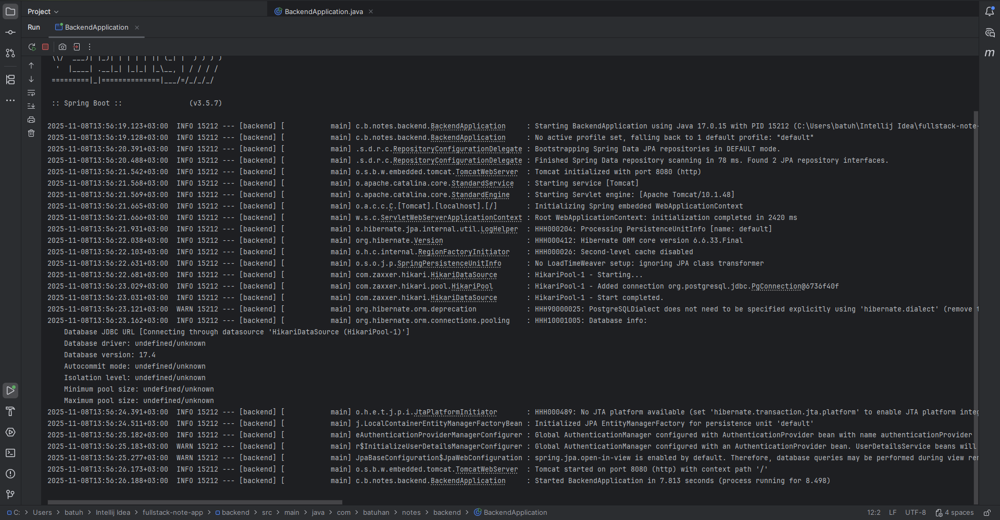

#### 1.2. Front-end Başlangıcı (VS Code)

* **Kanıt:** React (Vite) geliştirme sunucusunun başarıyla başlatıldığını gösterir.

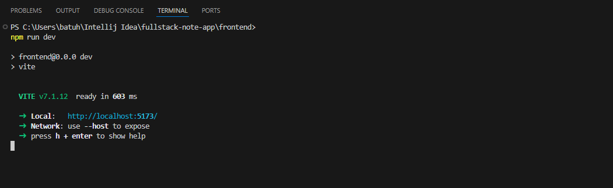

---

### 2. 💾 Veri Kalıcılığı ve RBAC Kanıtı (DBeaver)

API'nin verileri doğru şema ile kaydettiğini ve yetkilendirme altyapısını gösterir.

#### 2.1. Kullanıcı ve Rol Kanıtı

* **Kanıt:** `_user` tablosunda **ROLE\_ADMIN** ve **ROLE\_USER** rollerinin oluşturulduğunu gösterir. Şifreler **BCrypt** ile şifrelenmiştir.

#### 2.2. Not Kaydı Kanıtı

* **Kanıt:** Notların başlık, içerik, `completed` durumu ile birlikte kalıcı olarak saklandığını kanıtlar.

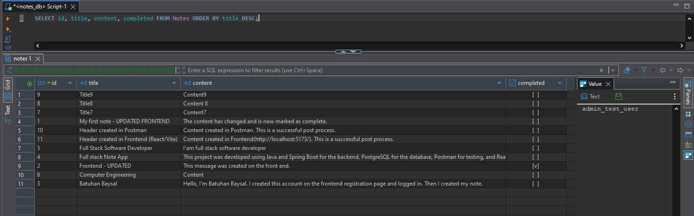

---

### 3. 🔐 API Güvenliği ve Yetkilendirme Testleri (Postman)

Projenin en kritik özelliği olan **JWT tabanlı güvenliğin** kusursuz çalıştığını kanıtlar.

#### 3.1. Giriş Başarısı ve JWT Alma

* **Açıklama:** Kullanıcı adı/şifre ile başarılı giriş sonrası API'nin **200 OK** ile JWT Token'ı döndürdüğü kanıtlanır.

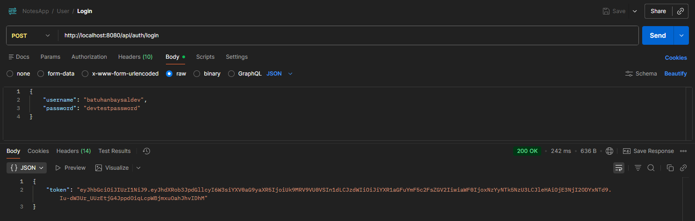

#### 3.2. Korumalı Erişim ve Token Gönderimi

* **Açıklama:** Alınan JWT'nin `Authorization: Bearer` başlığı ile korumalı CRUD endpoint'ine başarılı erişimi gösterir.

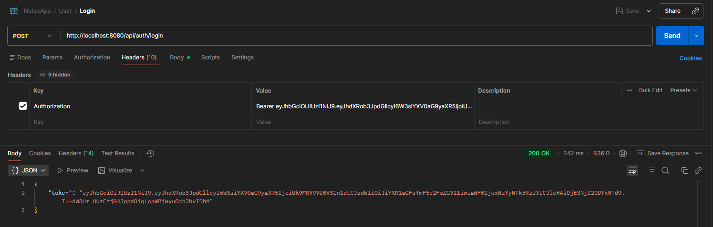
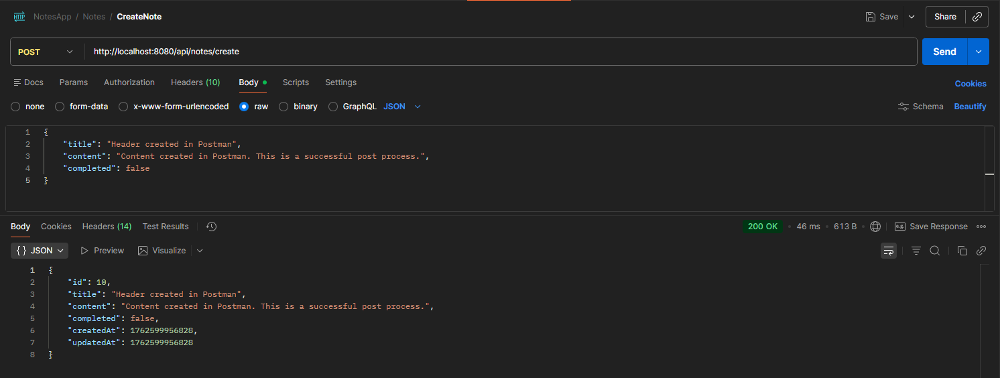

#### 3.3. RBAC (403 Forbidden) Kanıtı

* **Açıklama:** Normal bir kullanıcının (USER rolü), Admin endpoint'ine erişiminin **403 Forbidden** ile engellendiğini kanıtlar.

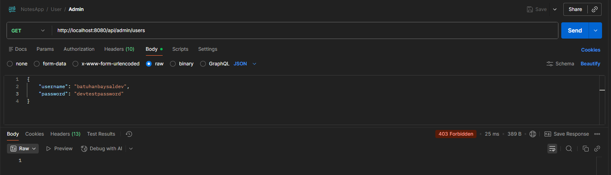

---

### 4. 🎨 Kullanıcı Arayüzü (Front-end SPA) İşlevselliği

Son kullanıcının etkileşimde bulunduğu ana ekranları ve kritik özellikleri gösterir.

#### 4.1. Kullanıcı Kaydı ve Girişi (Authentication Flow)

* **Açıklama:** Kullanıcı kayıt arayüzünün görünümü.

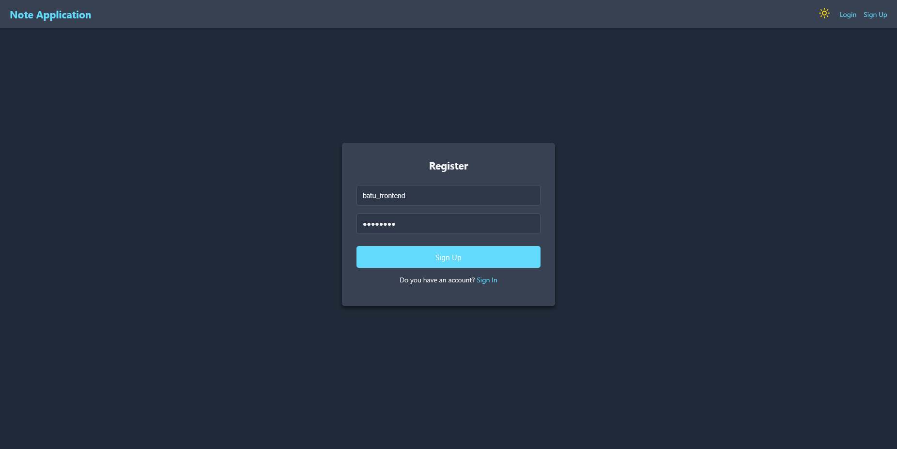

#### 4.2. Not Yönetimi Ana Ekranı (CRUD)

* **Açıklama:** Temel not listeleme, Paginasyon ve yeni not oluşturma işlevini gösterir.

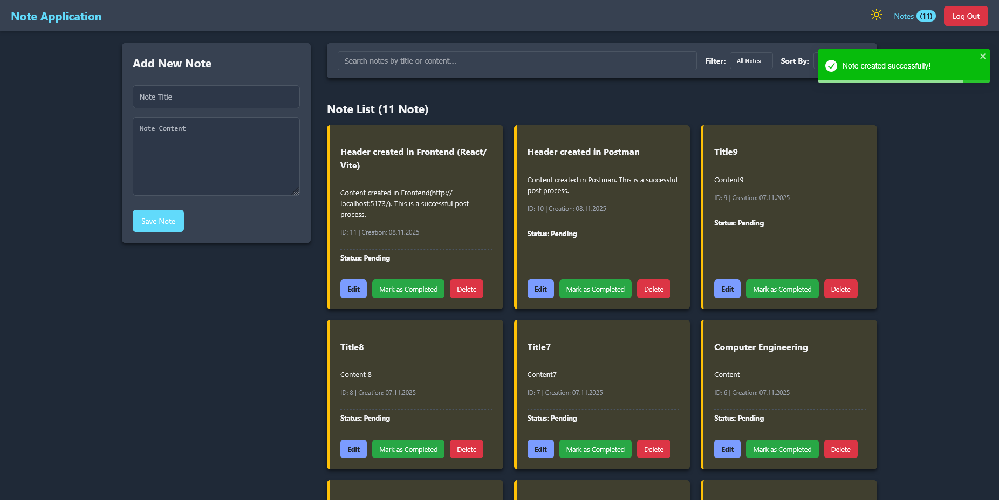

#### 4.3. Gelişmiş Filtreleme ve Arama

* **Açıklama:** Notların durumuna (tamamlandı/beklemede) göre filtreleme işlevinin kanıtıdır.

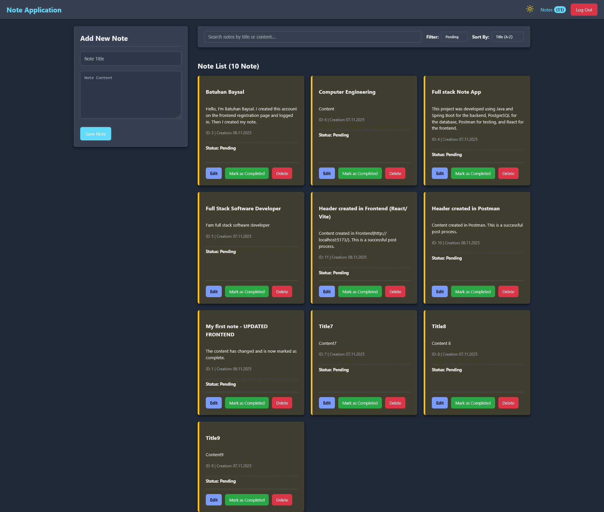

* **Açıklama:** Metin arama işlevinin aktif olduğunu gösterir.

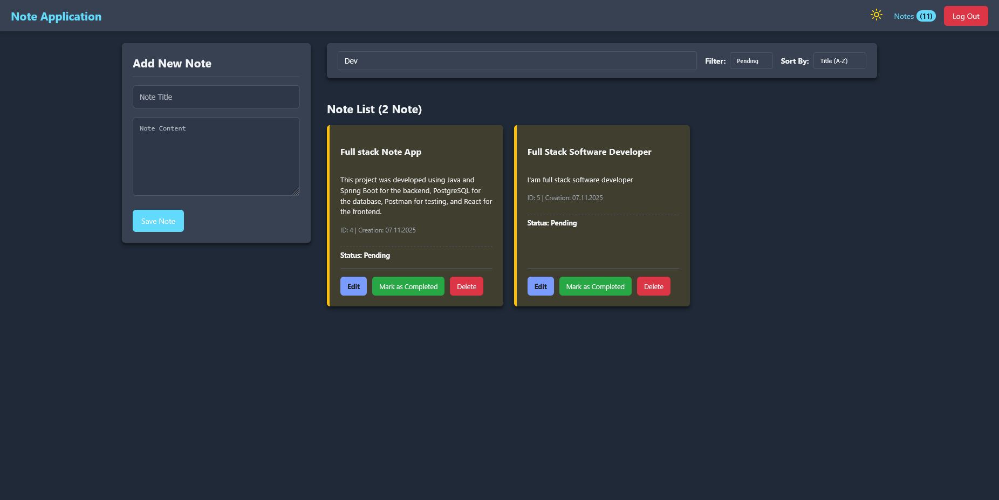

#### 4.4. Yönetici Paneli ve Tema (UX/UI Kanıtı)

* **Açıklama:** Sadece Admin rolünün erişebildiği kullanıcı yönetimi panelini gösterir (**RBAC Görsel Kanıtı**).

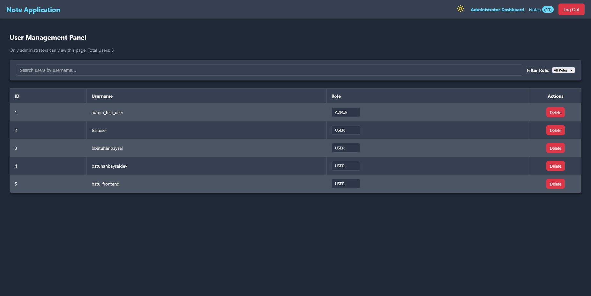

* **Açıklama:** Dark/Light tema geçişi özelliğinin kanıtıdır.

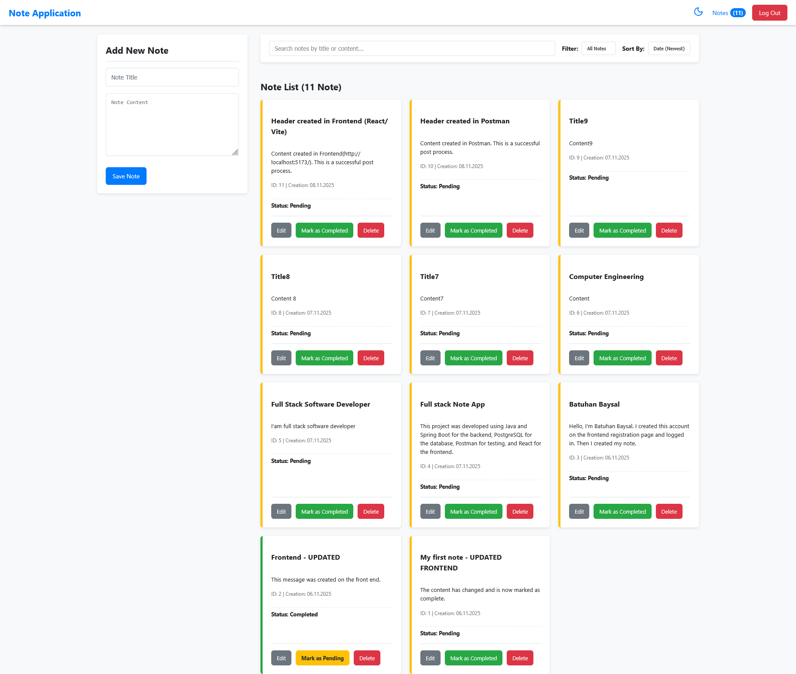

---

## 📁 Detaylı Mimari ve Dizine Genel Bakış

### 🧠 Back-end Dizini ve Sorumlulukları (Java / Spring Boot)

| Dizin | İçerik Örnekleri | Ana Sorumluluklar |
| :--- | :--- | :--- |
| `config` | `SecurityConfig`, `JwtAuthenticationFilter` | **JWT Güvenlik Zinciri** yapılandırması. |
| `controller` | `NoteController`, `AdminController` | **API Endpoint** yönetimi, gelen HTTP isteklerini karşılama. |
| `dto` | `AuthenticationRequest`, `RegisterRequest` | Veri Transfer Nesneleri (DTO). |
| `entity` | `NoteEntity`, `UserEntity`, `Role` (Enum) | Veritabanı tablolarını temsil eden JPA varlıkları. |
| `exception` | `GlobalExceptioHandler` | Uygulama genelinde merkezi **Hata Yönetimi**. |
| `repository` | `NoteRepository`, `UserRepository` | Veritabanı erişim katmanı (**Spring Data JPA**). |
| `service` | `NoteService`, `AdminService`, `JwtService` | Uygulamanın **İş Mantığı**nın ve Transactional işlemlerin yönetimi. |

### ⚛️ Front-end Dizini ve Sorumlulukları (React / Vite)

| Dizin | İçerik Örnekleri | Ana Sorumluluklar |
| :--- | :--- | :--- |
| `pages` | `HomePage`, `AdminPage`, `LoginPage` | Uygulamanın **Routing** tarafından erişilen ana görünümler. |
| `components` | `Navbar`, `NoteEditModal`, `NoteForm` | Tekrar kullanılabilir, küçük ve orta ölçekli UI parçaları. |
| `context` | `AuthContext`, `ThemeContext` | Uygulama genelindeki **Global State** yönetimi. |
| `services` | `NoteApiServices`, `AuthApiService` | **Axios** tabanlı tüm Back-end API çağrılarının ve Interceptor mantığının yönetildiği yer. |
| `routes` | `AdminRoute` | Kullanıcı yetkisine göre sayfa erişimini kontrol eden korumalı rotalar. |

---

## 🚀 Projenin Geleceği ve İyileştirmeler

Bu başlık, projenin sadece "yapıldı" demenin ötesinde, sürekli gelişime açık bir bakış açısıyla ele alındığını gösterir.

### 1. 🛡️ Güvenlik ve Performans İyileştirmeleri

* **Token Yenileme (Refresh Token):** Kullanıcı deneyimini kesintiye uğratmamak ve güvenliği artırmak amacıyla, kısa ömürlü JWT'lerin süresi dolduğunda otomatik olarak yenilenmesi.
* **Back-end Filtreleme Optimizasyonu:** Front-end'de uygulanan filtreleme/arama mantığını, performans ve verimlilik için tamamen Back-end'e taşımak.

### 2. 🧪 Test Otomasyonu

* **Unit ve Integration Testleri:** Back-end'de **JUnit** ve **Mockito**; Front-end'de **Jest** ve **React Testing Library** ile kapsamlı testler eklenmesi.

### 3. 🌐 Gelişmiş Dağıtım

* **CI/CD Pipeline:** Otomatik dağıtım için Jenkins veya GitHub Actions entegrasyonu.